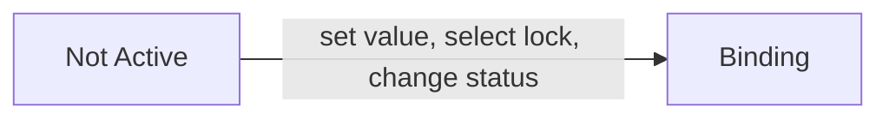
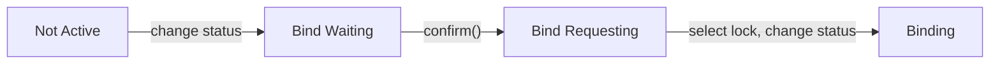
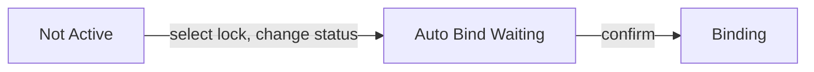

# 5 of status of Bind and 3 ways for bindingof your application's running to the specific condition

The status of a normal Bind will be one of the following five.
The following table summarize for each status the return value of confirm (), the change of the key of bind in koshinto, and the transition of status of bind in koshinto.

|status|return|change of bind key on the koshinto|transision of bind status on the koshinto|
|------|------|----|----|
|Not Active|always ng_comfirmed|no change|no change|
|Bind Waiting|always ng_comfirmed|updated with the values from confirm()|to Bind Requesting|
|Bind Requesting|always ng_comfirmed|no change|no change|
|Auto Bind Waiting|always ok_comfirmed|updated with the values from confirm()|to Binding|
|Binding|ng_comfirmed or ok_comfirmed depend on the values from confirm()|no change|no change|

There are three ways to set the key value, lock it and set the state to "Binding".

## 1. In case you know well the value of the key you want to bind.
In case you have concret understanding about the key you would bind, this is strait forward way.

### Steps.
1. At the KoshintoOpen the bind your application is using.
2. Open keys and set the **value** of the key you would bind it, then set the **lock** ✓. Then click **UPDATE** button at the bottom right.

3. Open status and select it as **Binding**. Then click **UPDATE** button at the bottom right.

The transitions of status can be summarized as follows:

## 2. In case you don't know how to get the key value or want to save the trouble of get it
Even in the following troublesome cases, you can use this procedure to set the startup conditions of your application as you wish.
- In case you want to bind it to the terminal you have now, but don't know how to get the key or want to avoid troubles to get it yourself.
- In case you provide an application to someone and you don't know what environment before they will use.

### Steps.
1. At the KoshintoOpen the bind your application is using.
2. Open status and select it as **Bind Waiting**. Then click **UPDATE** button at the bottom right.

3. Back to your application, call confirm().
4. Back to koshinto, refresh Bind data on the Browser with clicking the floating action button of round arrow icon at the bottom right.

5. Open keys. You can see the values of keys are updated by what sent from confirm(). Select one of them and ✓ the **lock**. Then click **UPDATE** button at the bottom right.

6. Open status. You can see that the status has transitted to **Bind Requesting**. Select **Binding** and click **UPDATE** button at the bottom right.

The transitions of status can be summarized as follows:

## 3. In case you want to automatically bind it to the values of first confirm().
The following steps are useful in case you provide an application to someone and you want to bind it automatically to the environment they will use.

### Steps.
1. At the KoshintoOpen the bind your application is using.
2. Open keys. Select keys you would lock to and set checked the **lock** as ✓. Then click **UPDATE** button at the bottom right.

3. Open status and select it as **Auto Bind Waiting**. Then click **UPDATE** button at the bottom right. That's it!

4. After your application runs and confirm () is called, refresh Bind data on the Browser with clicking the floating action button of round arrow icon at the bottom right.

5. Open keys, You can see that they are updated with the values ​​in the user's environment.

The transitions of status can be summarized as follows:

